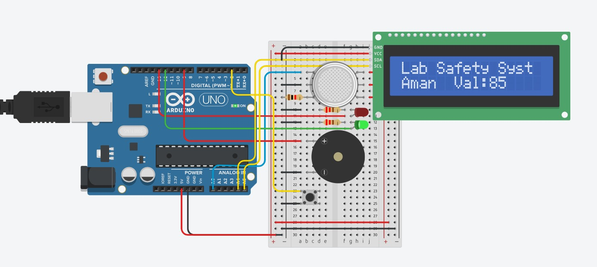

# rangkaian

## breadboard
- negatif → gnd arduino
- positif → 5v arduino

## Sensor Gas/Asap (MQ-2 / sejenis)
- VCC sensor → 5V
- GND sensor → GND
- AOUT sensor → pin A0 Arduino

## LCD I2C 16x2
- GND → GND
- VCC → 5V
- SDA → pin A4 Arduino
- SCL → pin A5 Arduino

## LED
- LED Hijau → pin 12 dengan resistor 220 ohm
- LED merah → pin 13 dengan resistor 220 ohm
- dannegatif → GND

## Buzzer
Pin positif buzzer → pin 9 Arduino
Pin negatif buzzer → GND

## Push Button
- ke pin 2 arduino
- ke GND
